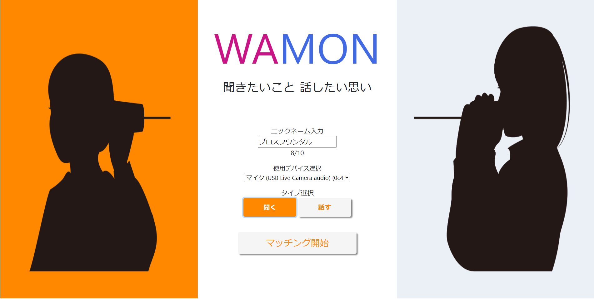

# WAMON

#### WAMON とは？

##### 話し手(話:WA)と聞き手(聞:MON)に分かれて知らない人とリアルタイムで通話をすることができる Web サービスです！

 

#### 詳細

<table>
  <tr>
    <td> 使用技術 </td> <td>Vue.js (Nxut.js)、WebRTC、FireBase</td>
  </tr>
  <tr>
    <td> 開発期間 </td> <td>6カ月</td>
  </tr>
  <tr>
    <td> デプロイURL </td> <td>現在は停止中</td>
</table>

 

### 遊び方

##### ニックネーム、マイク、マッチ条件(話す or 聞く)を選択しマッチング開始をクリックするだけ！

##### あとは会話を楽しみましょう

