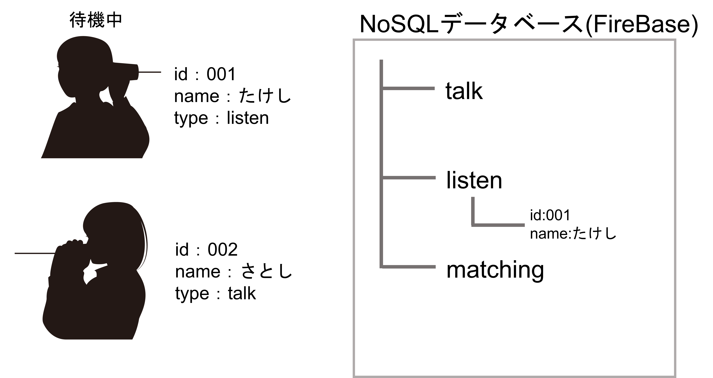

# WAMON

### WAMON とは？

##### 話し手(話:WA)と聞き手(聞:MON)に分かれて知らない人とリアルタイムで通話をすることができる Web サービスです！

 

### 詳細

<table>
  <tr>
    <td> 使用技術 </td> <td>Vue.js (Nxut.js)、WebRTC、FireBase</td>
  </tr>
  <tr>
    <td> 開発期間 </td> <td>6カ月</td>
  </tr>
  <tr>
    <td> デプロイURL </td> <td>現在は停止中</td>
</table>

 

### 遊び方

##### ニックネーム、マイク、マッチ条件(話す or 聞く)を選択しマッチング開始をクリックするだけ！

##### あとは会話を楽しみましょう

 

### マッチングの仕組み

##### １.たけし君は人の話を聞きたそうです。

##### ２.マッチングを開始するとデータベースで話したがっている人がいないか確認します。今回は talk 上にデータが存在しないため話したがっている人はいなさそうです。なので話したがっている人を待機するフェーズに入ります。

##### ３.さとし君は今日の出来事を話したがっています。

##### ４.マッチングを開始すると聞きたがっている人がいることが判明しました。

##### ５.そしたらマッチングにはいります。データベース上では二人の id と相手を見つけた側の名前を含んだデータが matching の子要素となります。

##### ６.その後、待機中のたけし君にマッチングが成功した通知が届き、相手の名前と id が分かりました。

##### ７.以上の過程でお互いのデバイスを WebRTC を通して繋げることができるため、通話が可能となります。

